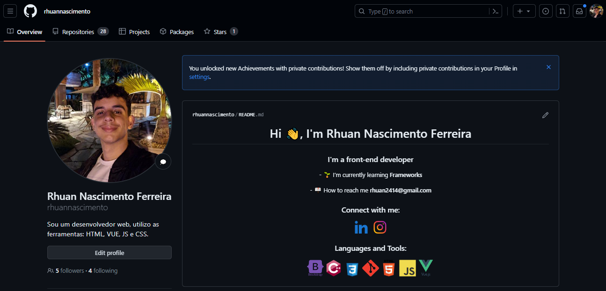
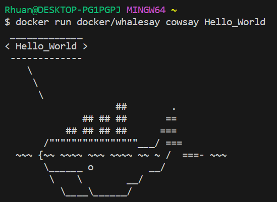
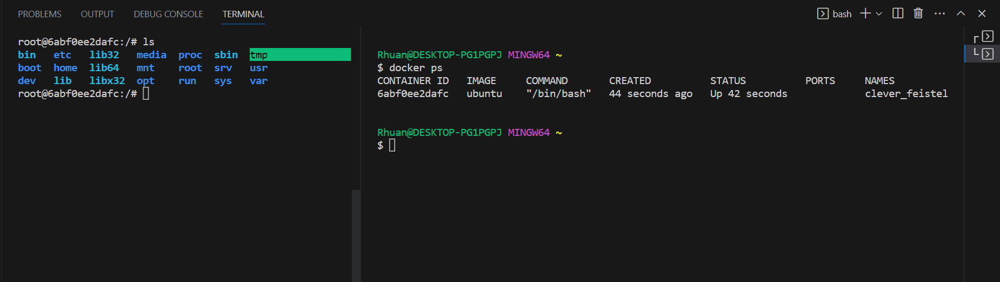
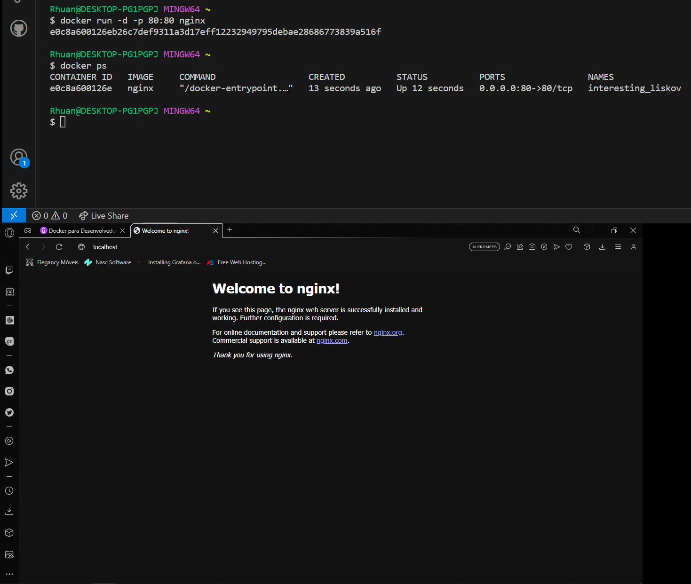
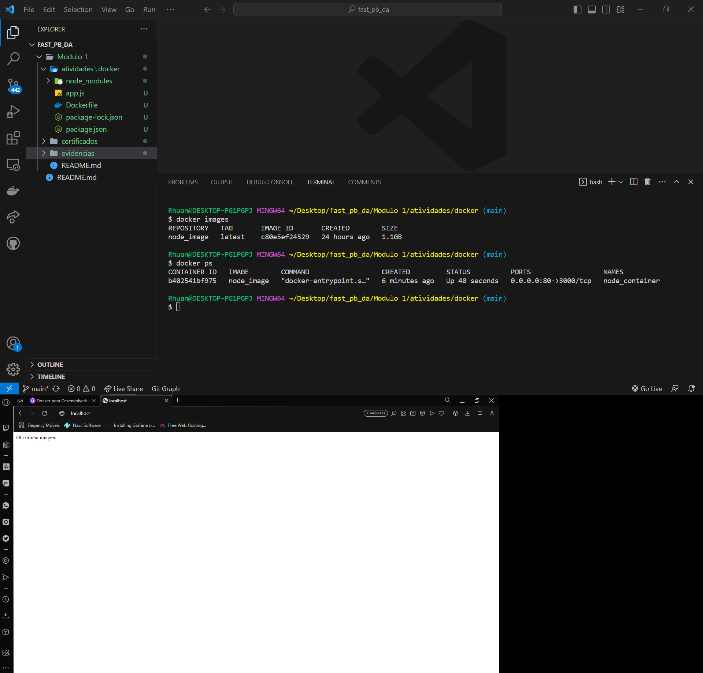
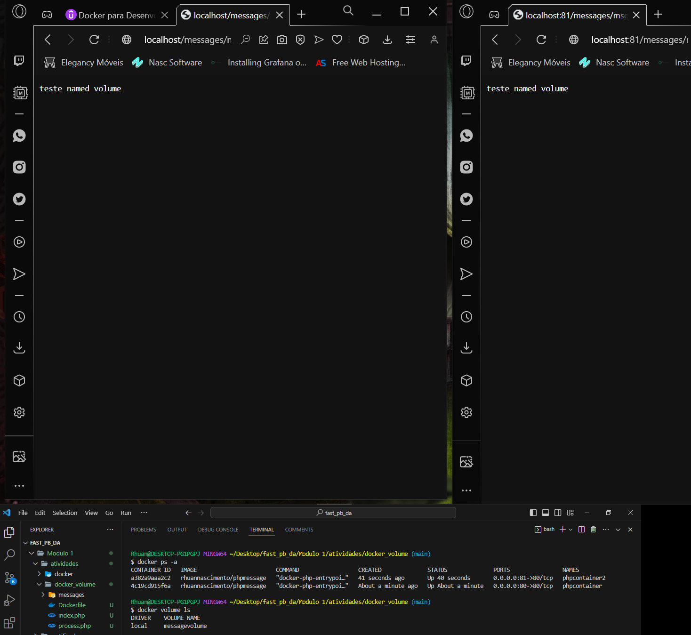
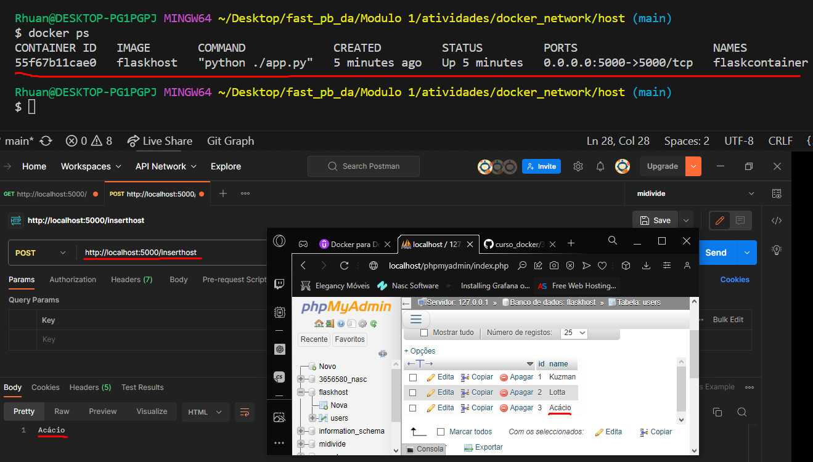
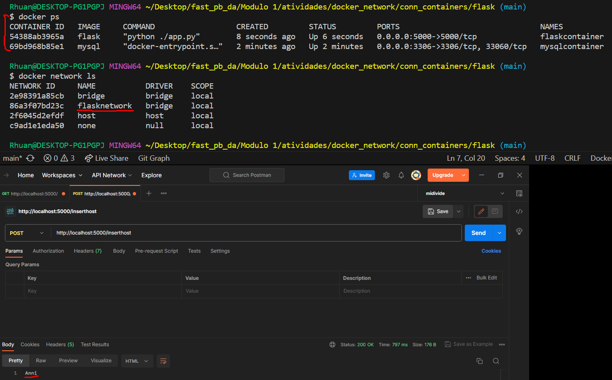
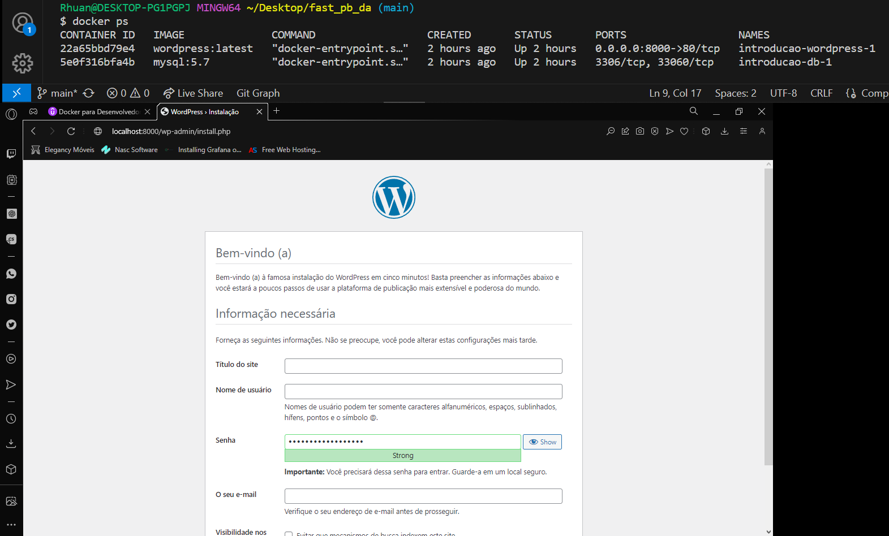

# Exercícios

1. [Resposta exercicio criando sua propia imagem docker.](./atividades/docker/Dockerfile)
2. [Resposta exercicio volumes.](./atividades/docker_volume/index.php)
3. [Resposta exercicio network.](./atividades/docker_network/conn_containers/flask/app.py)
4. [Resposta exercicio docker compose](./atividades/docker_compose/projeto/docker-compose.yaml)
5. [Atividade python](./atividades/python/ex1.py)
6. [Atividade python](./atividades/python/ex2.py)
7. [Atividade python](./atividades/python/ex3.py)
8. [Atividade python](./atividades/python/ex4.py)

# Evidências

Após concluir o curso de Git, percebi que o conteúdo abordado já era familiar para mim. Movido por isso, decidi compartilhar a página inicial do meu repositório no GitHub. Ao explorar o conteúdo, você terá a oportunidade de verificar a aplicação de algumas prática dos conceitos apresentados no curso de GIT.

Graças à minha experiência prévia na área de informática e ao meu histórico de conclusão de um curso técnico, o curso de Linux se revelou uma jornada relativamente tranquila para mim. Mesmo assim, essa experiência não tirou o mérito do curso, que acabou reforçando meus conhecimentos e aprofundando minha compreensão do sistema operacional Linux.

Na imagem abaixo, tive minha primeira experiência com Docker. Embora já tivesse ouvido falar sobre essa tecnologia anteriormente, nunca a explorei profundamente. Confesso que fiquei entusiasmado com as possibilidades que o Docker oferece. Uma coisa é certa: daqui para frente, todos os meus projetos contarão com Docker, aproveitando ao máximo essa ferramenta versátil e poderosa.

Conforme eu avançava no curso, comecei a descobrir como rodar várias imagens no Docker, até mesmo criando uma imagem personalizada. Aprendi a mudar os nomes da imagem e do container, a abrir portas, adicionar tags e até a executar um container em modo interativo.

- [Meu repositorio no Docker](https://hub.docker.com/r/rhuannascimento/node)

Na seção de volumes do curso Docker, aprendi como persistir dados em containers e atualizá-los em tempo real. Existem três tipos de volumes: anonymous, named e bind mount. O bind mount foi o que mais me chamou a atenção, pois é com ele que se torna possível atualizar um container em tempo real. Além disso, com o uso de volumes, posso criar uma comunicação entre múltiplos containers.

Na imagem acima é possível ver 2 containers rodando com um volume compartilhado.

Na seção sobre redes, observei várias maneiras de conectar containers, e particularmente me impressionei com a abordagem da rede "bridge". Essa abordagem oferece a capacidade de conectar dois containers, permitindo que um deles utilize os recursos do outro de maneira eficiente.

A primeira conexão realizada foi a externa a partir de uma API, a conexão pode ser vista na iamgem a seguir.

Seguindo os estudos realizei a conexão de um container com meu banco de dados local, com essa conexão consegui inserir dados da aplicação do container em meu BD.

Já na próxima imagem, foram criados dois containers e estabeleceu-se uma conexão entre eles por meio de uma rede do tipo "bridge". O container Flask, por sua vez, utiliza essa conexão para inserir informações no container MySQL.

Na seção de Docker Compose, vi como simplificar e centralizar a inicialização e configuração de vários containers, tornando o processo mais organizado e eficiente.

Aprender Python foi uma experiência relativamente fácil para mim, em grande parte devido à minha sólida base em linguagem C. A semelhança entre as sintaxes dessas duas linguagens desempenhou um papel fundamental na minha facilidade de aprendizado.

# Certificados

[Certificado GIT](certificados/Certificado_curso_git.pdf)

[Certificado Linux](certificados/Certificado_curso_linux.pdf)

